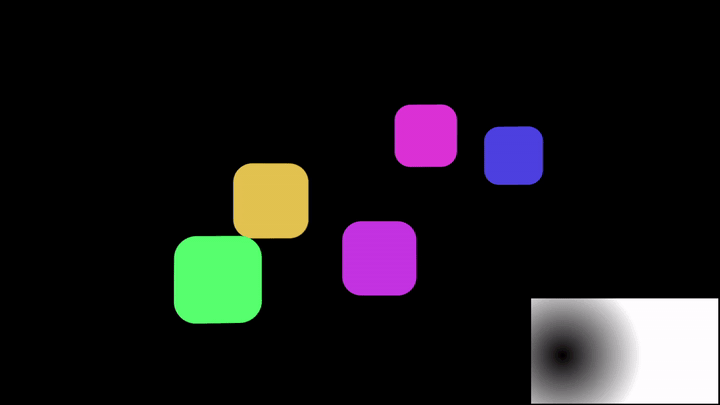

# Carousel Gradient Rig для After Effects



ScriptUI-панель для After Effects, которая собирает управляемую 2D/3D-карусель из выделенных слоев, добавляет удобные контролы формы и offset-ов, а при необходимости включает масштабирование от градиента.

## Возможности

- Собирает карусель из выделенных слоев: shape, text, footage, картинки, precomp.
- Создает центральный null `Carousel Control` выше слоев карусели.
- Привязывает слои карусели к control-null, чтобы весь риг можно было двигать и вращать как один объект.
- Поддерживает 2D и 3D раскладку.
- Добавляет `Carousel Width` и `Carousel Height` для формы 2D-карусели.
- В 3D-режиме создает `Carousel Camera` после слоев карусели.
- Может включить auto-orient слоев к камере.
- Добавляет per-layer offset sliders или опциональный глобальный randomized offset.
- Опциональный режим `Gradient Scale` меняет scale слоев от скрытого Ramp effect.

## Установка

Скопируйте `CarouselRig.jsx` в папку ScriptUI Panels:

```text
/Applications/Adobe After Effects <version>/Scripts/ScriptUI Panels/
```

На Windows обычно:

```text
C:\Program Files\Adobe\Adobe After Effects <version>\Support Files\Scripts\ScriptUI Panels\
```

Перезапустите After Effects и откройте:

```text
Window > CarouselRig.jsx
```

## Использование

1. Откройте композицию.
2. Выделите слои, которые нужно собрать в карусель.
3. Откройте `Window > CarouselRig.jsx`.
4. Оставьте `3D Layers` включенным для 3D-карусели или выключите для 2D.
5. Оставьте `Face Camera` включенным, если 3D-слои должны смотреть в камеру.
6. Включите `Random Offset`, если нужен глобальный randomized offset вместо offset-слайдеров на каждом слое.
7. Включите `Gradient Scale`, если scale должен реагировать на градиент.
8. Нажмите `Create Carousel`.

## Контролы

Скрипт создает null `Carousel Control`.

- `Radius`: создается только в 3D-режиме; радиус карусели.
- `Carousel Width`: создается только в 2D-режиме; общая ширина 2D-карусели.
- `Carousel Height`: создается только в 2D-режиме; общая высота 2D-карусели.
- `Rotation`: angle control для прокрутки распределения слоев по карусели.
- `Offset`: angle control для изменения расстояния между слоями карусели.
- `Random Offset X`: создается только с `Random Offset`; максимальный randomized X offset.
- `Random Offset Y`: создается только с `Random Offset`; максимальный randomized Y offset.
- `Random Offset Z`: создается только с `Random Offset` в 3D-режиме; максимальный randomized Z offset.
- `Random Offset Seed`: создается только с `Random Offset`; меняет randomized layout.
- `Min Scale`: создается только с `Gradient Scale`; scale для черных областей градиента.
- `Max Scale`: создается только с `Gradient Scale`; scale для белых областей градиента.

`Rotation` удобно анимировать для вращения карусели. Сам `Carousel Control` тоже можно двигать и вращать, чтобы трансформировать весь риг.

Если `Random Offset` выключен, каждый слой карусели получает свои `Item Offset X` и `Item Offset Y`. В 3D-режиме также добавляется `Item Offset Z`.

## Gradient Scale

Если включить `Gradient Scale`, скрипт создает скрытый guide layer:

```text
Carousel Gradient Scale
```

На нем лежит Ramp effect с именем `Carousel Gradient`. Expressions на scale слоев читают точки и цвета Ramp напрямую.

- Черные области дают `Min Scale`.
- Белые области дают `Max Scale`.
- По умолчанию Ramp диагональный.

Gradient layer скрыт, shy и помечен как guide layer. Его можно найти в timeline и вручную редактировать Ramp effect.

## Подводные камни

- Скрипт не использует `sampleImage()`. Он читает параметры Ramp напрямую, поэтому работает быстрее и стабильнее.
- Так как читаются именно параметры Ramp, дополнительные эффекты или плагины на `Carousel Gradient Scale` не учитываются.
- Двигать или скейлить сам gradient layer не основной способ управления. Лучше редактировать точки и цвета Ramp.
- Скрипт перезаписывает expressions позиции и scale на выбранных слоях карусели.
- Существующий parenting и auto-orient слоев могут быть заменены.
- `Face Camera` имеет смысл только в 3D-режиме.

## Связанный инструмент

Для управления произвольными выделенными параметрами через gradient field есть [GradientDriver](https://github.com/motionxamon/GradientDriver). В нем есть оптимизированная Ramp-версия и бонусная `sampleImage()`-версия для реальных pixel masks, plugins и precomps.

---

# Carousel Gradient Rig for After Effects


ScriptUI panel for After Effects that builds a controllable 2D/3D carousel from selected layers, adds shape and offset controls, and can optionally drive layer scale from a gradient.

## Features

- Builds a carousel from selected layers: shapes, text, footage, images, precomps.
- Creates a central `Carousel Control` null above the carousel layers.
- Parents the carousel layers to the control null, so the full rig can be moved or rotated as one object.
- Supports 2D and 3D carousel layouts.
- Adds `Carousel Width` and `Carousel Height` controls for 2D carousel shape.
- Creates a `Carousel Camera` after the carousel layers when 3D mode is enabled.
- Can auto-orient carousel layers toward the camera.
- Adds per-layer item offset sliders, or optional global randomized offsets.
- Optional `Gradient Scale` mode scales layers from a hidden Ramp effect.

## Install

Copy `CarouselRig.jsx` to your After Effects ScriptUI Panels folder:

```text
/Applications/Adobe After Effects <version>/Scripts/ScriptUI Panels/
```

On Windows this is usually:

```text
C:\Program Files\Adobe\Adobe After Effects <version>\Support Files\Scripts\ScriptUI Panels\
```

Restart After Effects, then open:

```text
Window > CarouselRig.jsx
```

## Usage

1. Open a composition.
2. Select the layers you want to arrange into a carousel.
3. Open `Window > CarouselRig.jsx`.
4. Leave `3D Layers` enabled for a 3D carousel, or disable it for a 2D layout.
5. Leave `Face Camera` enabled if 3D layers should auto-orient toward the camera.
6. Enable `Random Offset` if you want global randomized offsets instead of per-layer offset sliders.
7. Enable `Gradient Scale` if the layer scale should react to a gradient.
8. Click `Create Carousel`.

## Controls

The script creates a null named `Carousel Control`.

- `Radius`: created only in 3D mode; carousel radius.
- `Carousel Width`: created only in 2D mode; total width of the 2D carousel.
- `Carousel Height`: created only in 2D mode; total height of the 2D carousel.
- `Rotation`: angle control for rotating the layer distribution around the carousel.
- `Offset`: angle control for changing the spacing between carousel layers.
- `Random Offset X`: created only with `Random Offset`; maximum randomized X offset.
- `Random Offset Y`: created only with `Random Offset`; maximum randomized Y offset.
- `Random Offset Z`: created only with `Random Offset` in 3D mode; maximum randomized Z offset.
- `Random Offset Seed`: created only with `Random Offset`; changes the randomized layout.
- `Min Scale`: created only with `Gradient Scale`; scale value for black gradient areas.
- `Max Scale`: created only with `Gradient Scale`; scale value for white gradient areas.

You can animate the `Rotation` control for a spinning carousel. You can also rotate or move `Carousel Control` itself to transform the full rig.

When `Random Offset` is disabled, each carousel layer gets its own `Item Offset X` and `Item Offset Y` sliders. In 3D mode, each layer also gets `Item Offset Z`.

## Gradient Scale

When `Gradient Scale` is enabled, the script creates a hidden guide layer named:

```text
Carousel Gradient Scale
```

This layer contains a Ramp effect named `Carousel Gradient`. The carousel layer scale expressions read the Ramp start/end points and colors directly.

- Black areas drive layers toward `Min Scale`.
- White areas drive layers toward `Max Scale`.
- The default ramp is diagonal.

The gradient layer is hidden, shy, and marked as a guide layer. You can still find it in the timeline and edit the Ramp effect manually.

## Caveats

- This script does not use `sampleImage()`. It reads Ramp parameters directly, so it is faster and more stable.
- Because it reads Ramp parameters, extra effects or plugins applied to `Carousel Gradient Scale` are not sampled.
- Moving or scaling the gradient layer itself is not the main control surface. Edit the Ramp start/end points and colors instead.
- The script overwrites position/scale expressions on selected carousel layers.
- Existing layer parenting and auto-orient settings may be replaced.
- `Face Camera` only matters in 3D mode.

## Related Tool

For driving arbitrary selected properties with a gradient field, see [GradientDriver](https://github.com/motionxamon/GradientDriver). It includes an optimized Ramp version and a bonus `sampleImage()` version for real pixel-based masks, plugins, and precomps.
